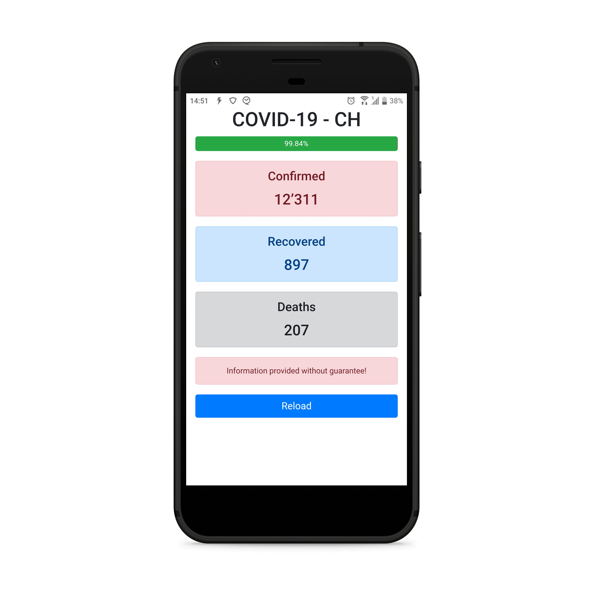

# covid-19 - ch (switzerland)

       

This app shows the confirmed, recovered and deaths from COVID-19 of switzerland.

#### API
The API is used from https://covid19.mathdro.id/api

## Information provided without guarantee!